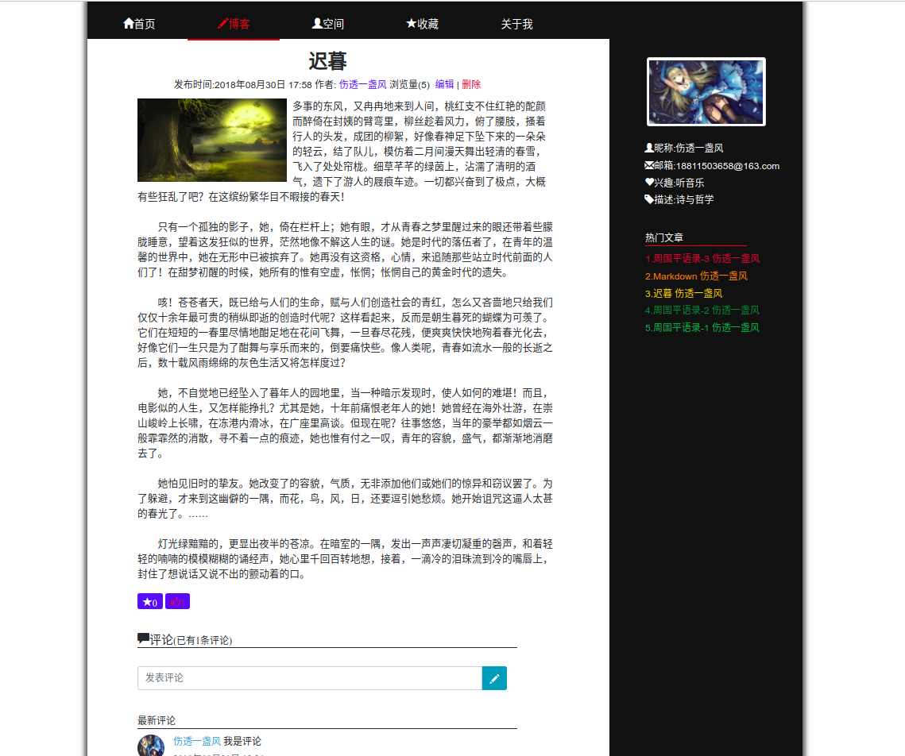
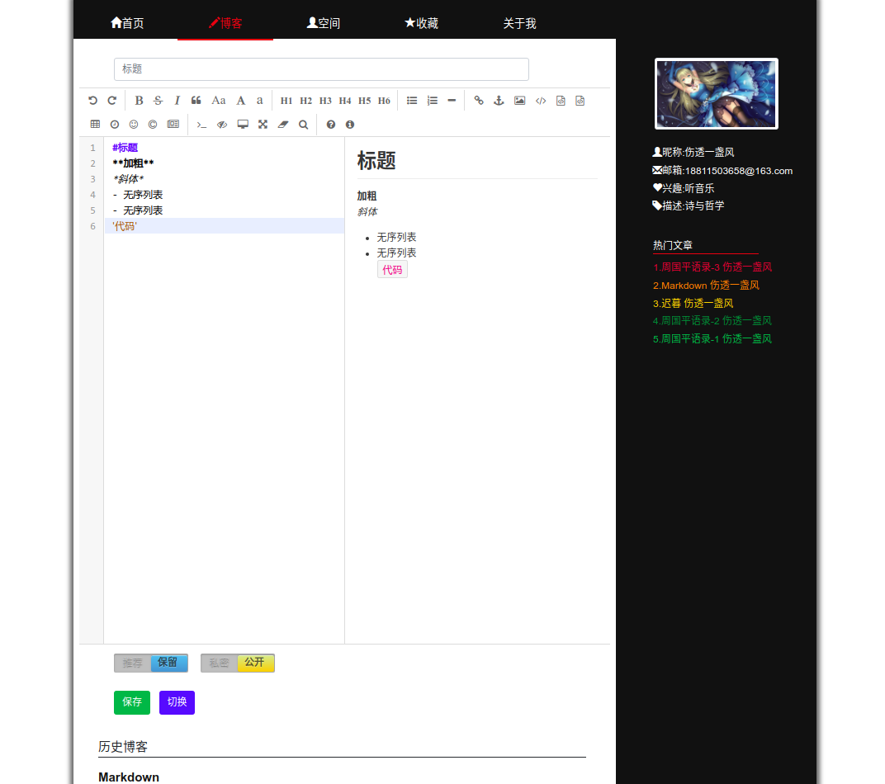

# MyBlog

### 功能简介

- 注册登录
- 撰写博客,集成了editormd,支持markdown语法
- 关注，收藏，点赞
- 私密博客自己可见，推荐博客展示在首页
- 热门文章

#### 截图(仅展示部分)

##### 首页

##### 文章详情页

##### 博客编辑

### 技术路线

该项目是本人学习spring和hibernate整合时所做的练习项目,spring+springmvc+hibernate,数据库使用mysql,另外在热门文章那一块简单的使用了一下redis,存储点赞数前五的博客，前台使用jsp+jquery+css+bootstrap,总体功能比较简单，但也算完整，适合新手练习。项目部署在阿里云tomcat服务器上，这里贴出网站网址[MyBlog](http://111.231.141.30:8080/MyBlog/index/)。如果想要做出更好看功能更全的博客，可以看看我star的这个仓库[ForestBlog](https://github.com/saysky/ForestBlog)，这个就很厉害了，页面也很好看，用的mybatis，大家一起慢慢学习吧。
